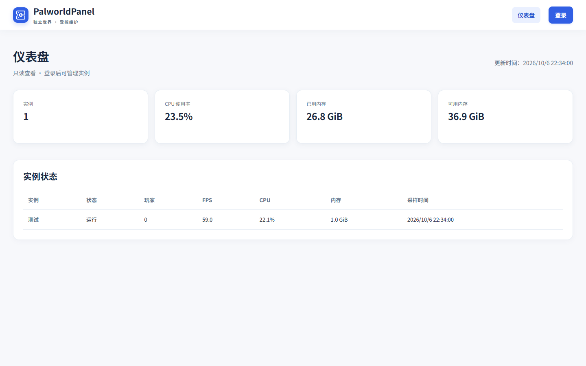

# PalworldPanel


PalworldPanel 是面向单台服务器的幻兽帕鲁多实例 Web 管理面板。通过一个控制台创建独立世界、查看运行状态、修改游戏参数、管理备份恢复和维护任务，游戏服务始终在 Docker Linux 容器中运行。

[项目官网](https://lazyworkshopcreate.github.io/PalworldPanel/) · [用户文档](website/docs/index.html) · [发布日志](website/releases/index.html) · [版本下载](https://github.com/LazyWorkshopCreate/PalworldPanel/releases) · [安装与维护](docs/operations/2026-10-06-windows-deployment-r4.md) · [文档导航](docs/README.md)

源码以 MIT 许可证公开，发行包可从 GitHub Releases 下载；下载后请核对 SHA256SUMS。

官网首页、用户文档和发布日志支持中文 / English 切换；英文内容源见 [English website](website/en/index.html)。管理控制台当前使用中文。

## 主要能力

- **独立实例**：各自使用独立目录、存档、密码、端口、备份与任务锁；支持新建世界和受控接管已有实例。
- **状态与日志**：查看宿主监控、实例状态和游戏地址；初始化展示阶段进度，日志按最新记录优先显示。
- **参数草稿**：中文名称与字段搜索，对照当前值、默认值和草稿；密码支持随机生成，只显示设置状态。修改先保存草稿，再确认应用。
- **备份与恢复**：定时与手动备份、恢复前备份和停止对应实例、加密导出恢复点、导入世界 ZIP。
- **受控维护**：实例操作二次确认，后台任务记录执行阶段；应用配置期间锁定操作，避免重复提交。
- **内网访问**：精确 IP 白名单；允许地址内可匿名查看只读仪表盘，管理操作要求登录。

## 界面预览

以下为本机控制台实拍；点击图片可查看原图。

### 只读仪表盘

无需登录即可查看主机用量和实例状态。



## 部署方式与边界

| 平台 | 面板运行方式 | 游戏运行方式 | 发行文件 |
|---|---|---|---|
| Windows x64 | Windows 服务，Inno 安装 | Docker Desktop Linux 引擎 | 自包含程序 ZIP、安装包 EXE |
| Linux x64 | 单个 Docker 面板容器 | Docker Engine / Compose | Docker 镜像归档 |

面板使用 C# / .NET 10、React / TypeScript 和 SQLite；部署后的程序无需 Node.js 或 pnpm。Linux 面板具有 root 和 Docker socket 权限，Windows 服务使用 LocalSystem 与本机 Docker Linux 引擎。访问仅面向明确允许的内网地址；管理 API 不直接公开。

游戏连接使用实例 IP 和 UDP 端口。公网 UDP 转发与诊断不在本项目范围内；TCP 或管理 API 健康不代表游戏客户端可连接。

## 快速开始

### Windows

1. 启动 Docker Desktop 的 Linux 引擎，确认 Compose v2 可用。
2. 从 [GitHub Releases](https://github.com/LazyWorkshopCreate/PalworldPanel/releases) 下载安装包及 `SHA256SUMS`，核对 SHA-256 后运行安装包。
3. 首次安装选择“重新配置”，设置内网监听地址、面板端口与精确 IP 白名单；安装前会检查依赖和端口。首次访问网站设置面板管理员密码。
4. 创建新实例并查看初始化任务，或先以只读方式接管已有实例。

升级选择“仅升级程序”，保留配置、管理员与实例数据，完整交换程序目录。程序 ZIP 供手工部署使用；服务注册与升级步骤见 [Windows 手册](docs/operations/2026-10-06-windows-deployment-r4.md)。

### Linux

从 Releases 下载 Docker 镜像归档并校验，使用 `docker load` 导入。源码构建可执行：

```bash
docker build --build-arg PANEL_VERSION=0.1.0-rc.1 -f deploy/Dockerfile -t palworldpanel:0.1.0-rc.1 .
```

运行前需配置持久化目录、内网白名单、访问配置与 Docker socket，按[部署与恢复手册](docs/operations/2026-10-06-local-run-and-recovery.md)完成初始化。镜像本身不含实例存档或管理员凭据。

## 构建、校验与发行

```powershell
pwsh -NoProfile -File scripts/Test-LocalBuild.ps1 -SkipDocker
```

Linux 普通账户运行包含游戏文件归属的后端测试时，需要在隔离测试环境使用 `-LinuxTestsAsRoot`。实际 Docker 构建和隔离场景见验证记录。

- **CI**：main 推送、PR 和手动触发，校验文档、版本契约、前端及 Linux/Windows 后端，再构建 Docker 镜像；不生成正式 Release。
- **Release**：推送合法 `v*` tag，核对 `version.json` 和带日期的版本说明，复用 CI 后打包。三个版本化产物齐全后生成 `SHA256SUMS` 并创建或更新 GitHub Release；预发布版本标记为 prerelease。
- **Pages**：仅随 `v*` tag 更新官网，使用该 tag 对应的静态页面与版本说明；与 Release 独立运行，两者都需查看结果。

本项目当前版本源为 [version.json](version.json)。发行操作、只打包演练和重跑规则见[流水线与发行手册](docs/operations/2026-10-06-release-workflow.md)。

## 仓库结构

```text
PalworldPanel/
├── .github/workflows/       日常 CI、版本发行、Pages 部署
├── version.json             发行版本源
├── src/
│   ├── PalworldPanel.Server/ .NET 后端、任务与适配层
│   ├── PalworldPanel.AdminWeb/ React 管理前端
│   └── PalworldPanel.Contracts/ 游戏参数元数据
├── tests/                   单元测试与隔离场景
├── deploy/                  Dockerfile 与 Windows 安装、服务脚本
├── scripts/                 构建、文档和发行检查
├── website/                 公开静态项目官网
└── docs/                    需求、设计、计划、发行说明与验证
```

## 第三方组件

| 组件 | 用途 |
|---|---|
| [.NET / ASP.NET Core](https://dotnet.microsoft.com/)、WindowsServices | 后端 API、后台任务和 Windows 服务 |
| [Microsoft.Data.Sqlite](https://www.nuget.org/packages/Microsoft.Data.Sqlite/)、SQLitePCLRaw | SQLite 存储与本机数据库提供程序 |
| [Serilog](https://serilog.net/) / Sinks.File | 结构化文件日志 |
| [React](https://react.dev/)、[Radix Dialog](https://www.radix-ui.com/primitives/docs/components/dialog)、[Lucide](https://lucide.dev/) | 前端组件、弹窗与图标 |
| [TypeScript](https://www.typescriptlang.org/)、[Vite](https://vite.dev/)、[pnpm](https://pnpm.io/) | 类型检查、前端构建与锁定依赖 |
| [xUnit](https://xunit.net/)、[Vitest](https://vitest.dev/)、Testing Library、jsdom、Prettier | 后端与前端测试、格式检查 |
| [Docker](https://www.docker.com/) / Compose | 游戏实例与 Linux 面板运行 |
| [Inno Setup](https://jrsoftware.org/isinfo.php) | Windows 安装包编译 |

## 文档

- [功能需求与官网需求](docs/README.md)
- [系统设计](docs/design/2026-10-06-system-design-r4.md)
- [Windows 安装与维护](docs/operations/2026-10-06-windows-deployment-r4.md)
- [本机部署与恢复](docs/operations/2026-10-06-local-run-and-recovery.md)
- [流水线与发行](docs/operations/2026-10-06-release-workflow.md)
- [版本说明](docs/releases/2026-10-06-v0.1.0-rc.1.md)
- [真实验证记录](docs/verification/2026-10-06-desktop-implementation.md)
- [贡献流程](CONTRIBUTING.md)

构建和 API 验证不能代替真实玩家连接、角色恢复或生产环境验收。非官方社区工具，与游戏开发商无隶属关系。

## 许可证与版本历史

本项目采用 [MIT 许可证](LICENSE)。第三方组件及游戏软件仍适用各自许可证；本仓库不包含游戏文件或玩家存档。公开仓库按版本 tag 汇总提交，每个版本对应一个源码快照提交，详见[公开发布约定](docs/operations/2026-10-07-public-release.md)。
