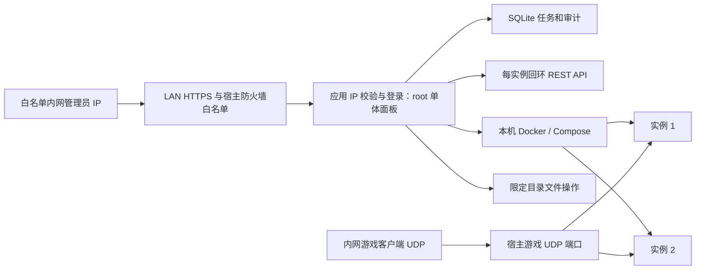

# 技术设计

版本日期：2026-10-06。修订日期：2026-10-06。状态：本机实现并验证，生产未部署。适用范围：单服务器、单管理员 MVP。替代来源：[原设计（历史）](2026-10-05-system-design.md)。需求见[业务需求](../requirements/2026-10-06-mvp-r5.md)，实际结果见[验证记录](../../../verification/2026-10-06-desktop-implementation.md)。运维初值见[运维策略](../../../design/2026-10-05-operational-defaults.md)，生产路径/地址仍为示例。

## 1. 架构与部署



一个 Web 进程包含页面、应用服务、后台采样和后台任务；SQLite 存元数据，游戏文件不入数据库。模块：InstanceRegistry、ComposeController、PalworldRestClient、SettingsService、BackupService、ImportValidator、TaskRunner、LocalDiagnostics。模块不是独立微服务。公网 UDP 转发与连通性在面板范围之外，不接入面板后台任务、状态、API 或验收。

本项目采用：后端为 C#/.NET 10、ASP.NET Core Minimal API；前端独立 React/TypeScript/Vite 项目，使用 pnpm、Radix Dialog、Lucide 和自有 CSS；Vite dist 在构建/发布阶段复制到 Server/wwwroot，由同一进程同源托管。开发环境 Vite 将 API 代理到回环后端，生产不运行 Vite/Node 服务。静态 SPA 与 API 分路由，API 未命中返回 JSON 404，不能被页面 fallback 吞掉；前端深链接刷新返回 index.html。未登录只显示登录 UI，静态资源不包含秘密，管理数据仍由 API 强制鉴权。

技术组件、数据库 provider、测试工具、依赖锁和构建契约统一见[技术栈规范](../../../design/2026-10-06-technology-stack-r2.md)。SQLite 审计与脱敏运行日志独立，所有管理读取须认证，日志按本项目保留策略处理。目录职责见[目录规划](../../../standards/repository-layout.md)，命名空间使用 PalworldPanel。

前端构建、资源复制、同源路由与缓存要求按技术栈规范执行，发布前验证入口 HTML、JS/CSS、深链接刷新和 API 鉴权。

采用独立面板容器，进程 UID 0（root）并具有 Docker 管理权限，host 网络；Web HTTPS 仅绑定指定内网接口 `<LAN_BIND_IP>:18080`，宿主防火墙与应用共同限制来源为显式白名单内网 IP。实际绑定地址/端口、允许客户端 IP 和 TLS 参数实施前配置，不从现有快照自动推导允许范围。已有游戏 REST 主机端口维持回环。镜像包含 .NET 10 运行时、Docker CLI/Compose、受控归档工具。实例根用同绝对路径挂载，避免在面板容器内解析出的卷路径指向宿主错误目录；不挂整段 /home 或 /，无需 privileged。Docker socket 权限意味着宿主控制权，不能把有限挂载当成对 root/Docker 后端的宿主隔离。

面板数据建议 `/var/lib/palworld-panel`：db、任务 journal、上传缓存、密钥引用（不存明文密钥）；独立备份根 `/srv/palworld-panel-backups/<instanceId>`。新实例根 `/srv/palworld-instances/<instanceId>`：compose.yaml、权限 0600 的 secrets.env、data/、staging/、restorepoints/。备份根和 staging 不在 Saved 内，避免递归打包。既有两实例按快照保留 `/home/example/palworld` 和 `/home/example/palworld-2`，从实际挂载确认 data/ 是绑定源，不能靠目录名推断。

SQLite 开 WAL、busy timeout、外键和 schemaVersion；单 Web/任务进程，启动持有面板执行器全局锁。不允许多副本。SQLite 备份用在线备份 API 或停面板复制一致性文件，不直接复制正在写的单个 .db。备份加密密钥与面板数据独立保管。

## 2. 实例身份、接管与目录隔离（REQ-02/03/13）

### 身份与发现

面板 UUID 是管理主键，世界 GUID 是游戏世界身份，两者不等同。容器 ID 会因重建变化，不作为永久主键。绑定包括 Compose 文件集合、projectName、serviceName、containerName、预期镜像仓库、canonicalRoot、dataMountSource、Saved 路径、端口映射和配置模式。

发现使用 Docker inspect 的投影字段；不直接返回 Env 全量。Compose 自带标签可辅助找 project/service/config 文件，自定义面板标签只用于新实例，既有实例无需补标签。没有 Compose 标签时由管理员选择已批准根下的 Compose 文件，校验其解析目标确实匹配已选容器；推不出唯一归属则只读。共享 Compose 项目可纳管单服务，但所有命令加 service 和 no-deps；有跨服务依赖/共享可写卷则拒绝 MVP 写模式。

所有路径 realpath 后必须位于明确批准的实例根内；拒绝 symlink、跨根 bind、路径祖先/后代相互重叠、相同 inode 的数据根，禁止共享可写安装文件。仅复用只读镜像层/包缓存，新实例安装目录独立。容器创建请求不能携带自定义挂载、特权或任意镜像，镜像仓库白名单固定为验证过的维护者镜像。

### 接管两阶段

1. 只读预检：身份、映射、配置源、生成开关、世界目录/GUID、UID/GID、资源限额、备份调度、restart policy、更新/重启脚本。敏感配置只在内存读取并立即脱敏，资料仓库不引用原 Compose 明文。
2. 登记：只写面板 DB，记录原文件 hash、运行状态摘要及时间；容器和 Saved 不变。看到运行世界只能标快照/现场读取，不声称玩家角色验证。
3. 写权限预检：隔离环境确认相同镜像模式；管理员安排维护窗口。读取源文件的无损修改方案、同文件系统 staging、权限和空间通过后，保存/停服/完整恢复点。
4. 写接管：保存原配置；关闭镜像自动升级/重启及重复备份调度，切换任务所有者；启动时更新改为面板显式升级。保留原路径、Compose 项目和世界。任何原 source hash 漂移重新预检，不能自动覆盖人工变更。

未知 YAML anchors、extends/include、多个 override、env_file 插值或 DISABLE_GENERATE_SETTINGS 模式在未验证前只读。不能为了接管重新生成整份 Compose。写管理采用精确字段补丁保留未知键、注释、env 来源和优先级；如果依赖库不能保证这一点，先做可审阅的配置规范化迁移，单独确认并备份，不绕过门槛。

### 新实例、克隆与删除

新建：分配 UUID/目录/项目/端口→原子占位→生成独立密码→写受控模板→Compose 校验→安装→首次启动→记录新 worldguid。克隆只复制公开规则、资源和备份计划，重新生成密码和端口；禁止复制 Saved、backups、restorepoints、原 secrets.env。可复用验证过的旧安装文件副本但严格排除这些目录，默认全新安装。

创建任务重试复用同 UUID 与预留端口；已存在而非本任务创建的路径立即拒绝。启动后新 GUID 不能与来源世界 GUID 相同；不在配置中预填 DedicatedServerName。

取消接管只删管理绑定（保留审计），不碰容器。移除容器限定服务，保留 bind 数据/配置/备份。永久清理停服、最终离线备份、验证 manifest 后，先移到同根 quarantine，保留 7 天后由明确清理任务复核再清理；最终备份独立至少保留 30 天，保护规则优先于期限。既有实例永久清理写开关默认关闭。禁止删除无法证明归属的父目录、其他容器/网络/卷，禁止全局 prune 或 down -v。

## 3. 端口、容量与资源（REQ-11/14）

| 角色 | 既有主机端口快照 | 新实例建议池 | 发布方式 |
|---|---|---|---|
| 游戏 | 8211/UDP、8213/UDP | 8221–8299/UDP | 必要网络接口，明确 UDP |
| REST | 127.0.0.1:8212/TCP、8214/TCP | 8321–8399/TCP | 仅 127.0.0.1 |
| 查询 | 未提供，待 inspect | 27015–27099/UDP | 默认不对外发布；需要社区发现再验证 |
| RCON | 未提供，待 inspect | 25575–25649/TCP | MVP 关闭；兼容时仅回环 |
| 面板 | 本次未部署 | 默认 18080/TCP（HTTPS） | 指定 LAN 接口；仅显式白名单内网 IP |

端口池是建议、非当前空闲证明。唯一约束 `(hostId, protocol, bindScope, hostPort)`，`0.0.0.0` 与任意具体地址冲突；IPv6 `::` 与 IPv4 双栈重叠也保守拒绝。新实例为便于维护，同一数字不同协议也不复用；既有合法 TCP/UDP 同号映射只读保留。容器内部通常各用 8211/8212/27015，映射到独立主机端口；若既有内部改端口则保留并登记。PublicPort 是广告地址参数，不能当监听端口或 NAT 配置。

创建和改端口持宿主分配锁，合并所有 Docker 发布（包括已停容器）、ss UDP/TCP 监听、登记预留；执行前再次核实。探测无法消除外部程序竞争，bind 失败释放本任务未使用的预留并返回冲突，不能抢占/杀进程。查询端口按用途保留，不因没有公开而假装不需要区分。

快照 29 GiB 内存，而实例上限 20 + 16 GiB = 36 GiB；限额是上限，不是预留或安全承诺。预留宿主/面板余量（初始 4 GiB 可调），新建默认总承诺不得超宿主预算；既有超额只报警，不自动降额。并发实际玩家、FPS、CPU/内存峰值测试后再定限额。CPU 用 cpus、内存用 mem_limit 等本地 Compose 支持字段，以 inspect 验证结果为准，不只改 YAML。恢复/升级空间预检需覆盖目标完整快照、ZIP 展开、staging、旧安装副本和安全余量；不将 677 GB 快照当实时可用空间。

## 4. 配置源、校验与生效（REQ-06）

保存三份视图：desired（草稿）、applied（最后成功写到配置源的版本）、observed（运行中 REST/inspect 观测）。desired/applied 不同为待应用；applied/observed 不符或未重启为待生效/无法核实；手工变化为 drift。不能因 up 返回 0 就标已生效。

| 面板字段 | Compose 环境 / 目标 | 类型与校验 | 有效证据 |
|---|---|---|---|
| 名称/说明 | SERVER_NAME / SERVER_DESCRIPTION | 面板策略名称 1–64 字符、说明 ≤256，拒绝控制符；序列化转义引号/括号 | info + settings |
| 游戏/管理密码 | SERVER_PASSWORD / ADMIN_PASSWORD | 独立随机生成；输入 ≤128 字符，强度策略、禁止换行/NUL；缺省意味着保持，明确 clear 才清空游戏密码，管理密码不得空 | 管理凭据认证成功；游戏密码仅客户端测试 |
| 玩家上限 | PLAYERS / ServerPlayerMaxNum | 当前镜像支持 1–32，整数；按镜像能力表限制 | settings、metrics |
| 死亡掉落 | DEATH_PENALTY / DeathPenalty | None / Item / ItemAndEquipment / All | settings |
| 离线惩罚 | ENABLE_NON_LOGIN_PENALTY / bEnableNonLoginPenalty | 布尔；字面映射须在目标镜像验证 | settings |
| 建筑自然衰减 | BUILD_OBJECT_DETERIORATION_DAMAGE_RATE | 有限非负数，0 关闭；MVP 建议 0–100（面板保护范围） | settings |
| 建筑受攻击伤害 | BUILD_OBJECT_DAMAGE_RATE | 独立于自然衰减；默认保留 1，不随“无衰减”修改 | settings |
| CPU/内存 | Compose cpus / mem_limit | CPU >0 且不超宿主，内存 ≥模板最低预算、总预算检查；不能把资源预检当负载保证 | Docker inspect/stats |
| 备份计划/保留 | 面板 BackupPolicy | 固定 Asia/Shanghai，初期每日时间 + 保留天数 1–365；不开放任意 cron/shell | 面板任务和 manifest |

这些映射来源见[调研 §2](../../../research/2026-10-05-assessment.md#2-现有镜像compose-与文件)，面板长度/范围是设计策略，不是官方游戏硬限制。完整参数扩展采用显式目录，原字段和类型不通用推导；未纳入目录的未知 INI 字段保留，不接受任意字段写入。

校验分字段校验、跨字段/容量、模板能力、Compose schema 和启动后观察。执行 Compose config 不向浏览器返回解析后的明文；捕获 stderr 也要脱敏。secrets.env 防 YAML/环境插值注入（包括 `$`、引号、换行），保留真实密码字符而非偷偷替换，序列化往返测试必须通过。

应用流程：If-Match 检查版本及文件 hash→持实例锁→公告、save→临时禁止自动重启→stop→离线恢复点→原子更新批准的配置源→config --quiet→对单服务 up -d --no-deps --pull never→REST/inspect 比对→落 applied revision。新凭据切换期间按任务阶段选择旧/新 secret，不在失败时轮试所有密码。失败回原配置和恢复点，未知有效状态保留停服。

生成模式绝不直接编辑 PalWorldSettings.ini。明确禁用生成的模式只有完成 INI 解析、同样往返校验后才能启用；MVP 可保持只读。恢复仅专门调整 GameUserSettings.ini 的 DedicatedServerName，绝不替换目标完整 Config。

## 5. 页面结构与线框（REQ-01/07/09/12）

所有页面遵循[前端 UI 规范](../../../design/2026-10-05-ui-style.md)，颜色、字体、留白、卡片、表格、按钮、状态、模态交互与响应式不在各页面重复定义。以下线框规定业务内容，不代表已经实现或视觉验收通过。

导航：实例 / 主机与安全。任务统一位于实例详情的任务页签，只显示当前实例的任务。白名单内未登录可查看只读仪表盘，主导航靠右；详情 tabs 为“概览、设置、日志、备份与恢复、连接诊断、任务”。所有危险动作显示当前实例名和 GUID 摘要，禁用按钮给原因。

```text
实例列表                  [接管既有实例] [创建新世界]
宿主：CPU/内存实测 | 预算超额提醒 | 磁盘余量 | 更新时间
名称            容器     游戏API   UDP地址与证据    玩家/FPS   最新备份  任务
palworld-server 运行     健康      LAN 未实测       --/--      外部快照  无
palworld-server-2 运行   健康      LAN 未实测       --/--      外部快照  无
（线框示意，运行/健康不是本次实测值）

实例详情：名称 / 世界 GUID / 接管模式 / 状态时间
[启动] [停止] [离线备份] [更多：重启/保存/升级/克隆/移除/清理]
概览：世界 GUID | 游戏版本 | 管理模式 | 运行/接口状态
      玩家/FPS | 天数/据点 | UDP端口 | CPU/内存用量 | 采样时间/状态
设置：中文名与原字段搜索 → 参数列表（中文名+字段 / 当前值 / 默认值 / 草稿值 / 修改）
      修改 → 单参数弹窗 → 保存到本页草稿 / 取消
      草稿 v3 | 配置源 v2 | 运行观测 v2  [保存草稿] [应用并重启]
密码：已配置 [更换]（无读取管理密码按钮）

备份与恢复：[立即离线备份] [上传 Saved.zip]
备份时间 | GUID | 游戏build | 一致性 | 校验 | 保留至 | [恢复]
导入向导：上传 → 预检 → 选世界 → 目标差异 → 停服恢复点 → 执行 → 核验
核验：API ✓ | GUID ✓ | 天数/据点 ✓ | 原账号角色：待玩家确认
[保留导入结果] [回退到导入前恢复点]

任务详情：实例 / 请求编号 / 类型 / 阶段 / 已耗时
✓ ZIP校验 ✓ 保存 ✓ 停服 ✓ 恢复点  正在切换文件
脱敏事件流；[取消]仅安全阶段可用，[重试/回退]按失败点提供
```

上传预检与执行是两个动作，预检不停止实例。预览页列出源 GUID、文件计数/展开大小、可识别玩家文件数、版本是否已知、忽略的 Config/Logs 和目标保留项。多世界必须选一个，结构不确定不能直接点击执行。ZIP 文件数不证明玩家身份正确。

创建页展示配置来源、独立世界提示、预算、端口预留和密码“重新生成”；接管页显示每项通过/未知/拒绝及只读状态。删除页分三个动作、准确路径和恢复点，不以通用“确定吗”代替影响说明。

日志默认最后 200 行，上限 2,000 行/1 MiB，跟踪限速并允许停止；显示游戏输出和任务事件两类来源。先结构过滤敏感字段，再掩码已知 secret 值、Authorization、URI userinfo、tokens 及玩家 IP/身份；控制字符编码、HTML 转义，超长行截断。脱敏失败则隐藏该块，禁止下载原始 inspect/env/config 或未经脱敏日志。

## 6. 数据模型

| 实体 | 核心字段 | 约束 |
|---|---|---|
| Host（唯一一行） | id、approvedRoots、portPools、memoryBudget、executorEpoch | 单宿主，不支持用户传任意 Docker 地址 |
| AccessPolicy（宿主配置，非 Web 可写实体） | listenIp、httpsPort、allowedClientIps、trustedProxyIps、allowedHosts、revision | 单独受限配置文件；内网来源且显式命中才放行；空/无效配置禁止监听，无默认内网全放行 |
| Instance | id、name、root、composeFiles、project、service、containerName、dataPath、configMode、managementMode、desiredPower、worldGuid、imageDigest、gameBuild、sourceHash、revision | UUID 主键；根目录和绑定唯一；managementMode=readOnly/write/blocked |
| PortReservation | instanceId、protocol、bindScope、hostPort、containerPort、purpose、taskId | 宿主冲突规则见 §3，创建未完也占位 |
| ConfigRevision | instanceId、number、publicSettingsJson、secretRefs、sourceHash、status、createdAt | 不存明文；Instance revision 作为并发 ETag |
| Secret | id、instanceId、purpose、ciphertext、nonce、keyVersion | 每实例隔离、认证加密、密钥不在 DB |
| BackupPolicy | instanceId、owner、localTime、timezone、retentionDays、mode、nextRun | owner=external/panel，任何时刻只一方调度 |
| Backup | id、instanceId、relativePath、sha256、bytes、manifestVersion、worldGuid、gameBuild、imageDigest、consistency、verifiedAt、protectedUntil、purpose | complete/verified 后才可恢复；恢复点受保护 |
| Upload | id、instanceId、randomPath、sha256、size、expandedBytes、expiresAt、status、selectedWorld | 私有数据、与实例绑定、不可任意下载；默认 24 小时过期，执行中不删除 |
| Task | id、instanceId、kind、idempotencyKey、requestHash、phase、state、expectedRevision、executorEpoch、deadline、checkpoint、backupId、resultCode | `(instanceId,kind,idempotencyKey)` 唯一；创建任务先分配 instanceId |
| TaskEvent / Audit | taskId、sequence、at、phase、safeMessage、actor、action、target、outcome | 不保存原请求密码/原始 stdout；事件序号单调 |
| Observation | instanceId、sampledAt、containerState、restState、metrics、source、errorCode | 缺失 nullable，最后好值和当前状态分开 |
| EndpointEvidence | instanceId、scope、protocol、address、result、testedAt、vantage、method | scope 仅 host/lan，人工 LAN 客户端证据明确标注；无公网/隧道字段 |
| Admin | id、passwordHash、securityStamp、failedAttempts、lockUntil | 一个账号，无开放注册 |

任务 journal 含预期路径、原/目标 hash、rename 步骤、restart policy、安装备份位置、恢复点；不含明文密码。备份 manifest 引用加密配置副本和 secret keyVersion，不能导出为公开 API 字段。世界/玩家文件仅保存在宿主受限文件区，绝不进入源码仓库。

## 7. 面板 HTTP 接口

面板前缀 `/api/v1`；它不同于游戏 `/v1/api`，不提供任意上游代理。整个 Web 入口先校验内网 IP 白名单（登录、静态文件、所有 API 和 SSE 均受控），再执行认证；登录入口和只读 `/api/v1/dashboard` 不需已有会话，其余管理路由含认证，写路由有 CSRF。同源 Cookie，拒绝宽泛 CORS。参数用 UUID/枚举，不能传 shell、自由路径或 REST URL。

| 方法与路径 | 作用 / 核心请求 | 响应 |
|---|---|---|
| POST/GET/DELETE /api/v1/session | 登录、CSRF 会话查询、退出 | 204/200，秘密不回显 |
| GET /api/v1/host；GET /discovery | 实际宿主用量/预算、脱敏既有候选 | 200 |
| POST /api/v1/discovery/register | containerId；默认只读、不重启 | 200 Instance |
| POST /api/v1/creation-previews | rules、可选 cloneId；无目录写入 | 200 plan/token/hash |
| GET /api/v1/instances；GET /instances/{id} | 列表、详情 | 200；详情 ETag |
| POST /api/v1/instances | 原 rules/cloneId/plan/token/hash、幂等键；再次检查端口/预算/源修订 | 202 Task 或 409 要求重新预检 |
| GET/PATCH /api/v1/instances/{id}/settings | desired/applied/observed；PATCH 公开草稿 + If-Match | 200；暂不应用 |
| PATCH /api/v1/instances/{id}/secrets | write-only administratorPassword/gamePassword + If-Match | 200 Instance；不返回明文 |
| POST /api/v1/instances/{id}/previews；POST /actions | kind、arguments、绑定修订的确认令牌；start/stop/restart/save/apply-config/upgrade/backup/import/restore/adopt/unmanage/retain-data/purge/undo-quarantine/finalize-purge | 200 preview；202 Task |
| GET /api/v1/instances/{id}/observations；GET /logs | 分层观测/本机 UDP、脱敏 Docker tail | 200；缺失明确 unknown |
| GET /api/v1/instances/{id}/events | SSE、Last-Event-ID | 有界阶段事件，可重连 |
| GET /api/v1/instances/{id}/backups；PATCH /backup-policy | 日程/保留天数 + If-Match | 200/204 |
| POST /api/v1/instances/{id}/uploads；DELETE /uploads/{uploadId} | 原始 application/zip 流、限制/CRC/世界预检；删除未使用上传 | 200 uploadId/hash/worlds；204 |
| POST /api/v1/instances/{id}/backups/{backupId}/export-prepare | 导出口令、近期认证 | 200 短期单次下载 URL |
| POST /api/v1/panel-backups/export-prepare；GET /downloads/{id} | 安全一致元数据导出；本人/同源 IP 绑定的单次流式下载 | 200；过期/重用拒绝 |
| GET /api/v1/tasks；GET /tasks/{id}；POST /tasks/{id}/cancel | 最近 200 项、单项、Queued 安全取消 | 200/204；Running 不强制取消 |
| POST /api/v1/tasks/{id}/recovery-preview；POST /recover | rollback/force-stop/acknowledge-safe/start-verification/confirm-players、原玩家核验和单次确认令牌 | 200；危险回退保持实例锁，完整恢复后才返回 |
| GET /api/v1/audit；GET /backups；GET /capabilities | 最近 200 条审计、独立恢复点、批准镜像与能力边界 | 200 脱敏记录 |

长操作接收 `Idempotency-Key`、If-Match 和确认令牌，令牌绑定管理员、实例、预览 hash/版本、动作和过期时间（初值 10 分钟）。重复 key + 相同 payload 返回原任务；不同 payload 返回 409。PATCH secret 响应不回显；上传 id/backup id 必须属于目标实例。

错误返回脱敏 code/message JSON：400 无效格式、401/403 认证/权限、404 未登记、409 TaskConflict/SourceDrift/PortConflict、412 ETag 过期、413 体积超限、400/409 包结构/兼容性拒绝、507 磁盘不足；任务内失败用 safeCode、phase及 recoveryPoint，允许恢复动作依据状态/原因确定。客户端不能从服务器路径错误获取原配置。读请求超时返回 stale/unknown，不阻塞其他实例。

## 8. 后台任务、锁与失败恢复（REQ-04/05/12）

状态：Queued → Running → Succeeded；Running 可到 Failed、Cancelled、NeedsAttention、RollingBack → RolledBack。自动检查通过而玩家尚未验证时，导入状态留 NeedsAttention（原因 PlayerVerificationPending），显示容器实际运行状态；只有人工核验完成才 Succeeded。可继续只读监控，限制升级/新导入直到接受或回退。

每实例 OS 文件锁（flock 等受支持实现，需 W03 验证）+ 数据库活动任务约束；单执行器在整个服务生命周期持有 OS 独占锁，不通过数据库租约过期抢锁；领取/取消以 SQLite 条件更新竞争。重启不能仅按租约超时抢锁：先确认旧执行进程/子进程退出，查询容器状态及 journal，再恢复。外部手工命令须使用同锁包装；无法保证时撤销写管理。文件锁避免协作脚本并发，不阻止拥有 root 的任意手工修改。

锁顺序固定：需要时宿主分配锁 → 实例锁；端口登记完成即释放宿主锁。恢复/备份持实例锁全程，重安装和大复制再取宿主重 IO semaphore（初值 1），同时其他实例读采样继续。不能在持实例锁时再申请分配锁；已选实例端口更改也按同顺序。跨实例任务可以轻量并行，不能以全局 Web 请求锁卡死监控。

任务先在 SQLite 入队，执行器有界轮询数据库，不以进程内通知承担持久性。阶段执行前写意图/fsync，执行后写结果/校验；SQLite 与文件切换通过 journal 恢复，不能承诺事务性 exactly-once。子进程固定 executable + ArgumentList，不用 shell 字符串；固定 project/service/工作目录，截断脱敏输出。面板绑定成功后才启动 worker；中断任务转 NeedsAttention、限制重启策略，不自动重放交换，人工依据 journal 回退或接受。

| 操作 | 阶段与成功条件 | 失败处理 |
|---|---|---|
| start | 身份/源hash验证→恢复已批准运行 policy→对目标服务 up→等待 REST、GUID、inspect | 身份错拒绝；启动超时不宣称停了；停止并保持 recovery hold 后再重试 |
| stop | 公告→REST save→持久记录原policy→临时 restart=no→Compose stop 目标→确认容器停止→desiredPower=stopped | save 失败默认中止；管理员另行 force-stop，记录可能丢进度；不会悄悄杀另一容器 |
| restart | stop→离线恢复点→start | 保存失败不重启；启动失败保持 hold |
| save | POST save→记录响应及时间 | 网络超时结果未知，可明确重试 save，不认为已建立备份 |
| apply-config | §4 流程 | 已备份才能换源；失败恢复原配置，若有效状态不明则停服 |
| upgrade | 预拉允许镜像→save/stop→Saved/配置恢复点+旧安装副本→更新镜像或游戏→关闭临时启动更新→验证 build/GUID/settings | SteamCMD 失败/新存档异常保持停服；回退配套旧安装+镜像+原存档，不混用新版存档 |
| backup | save→stop→离线快照→hash/可读性校验→恢复原运行意图 | 失败不轮转旧备份；若原运行且快照无文件修改，可安全重启；journal 必须确认 |
| import/restore | §10 的事务 | 交换后异常保持停服；显式 rollback |

stop 将实际 runtime policy 保持 no 直到显式 start；Compose 的正常 desired policy 作为登记字段保存，任务期间的暂时偏差登记为已知 override，不能被后台漂移修复自动撤销。start 才恢复批准 policy；应用后仍要求停服的任务再次施加 no。升级/恢复失败或断电重启不能让 Docker 以原 policy 先写存档，持久 journal 在任何文件变更前完成 policy no 并验证。REST shutdown 可能被 restart policy 拉起，MVP 不单独调用它作为停服保证；公告 + save + Docker 受控 stop 是否优雅由样机验证。API /stop 是强制退出，不用于日常保存关服。

Compose 重建会重置 runtime restart policy，因此验证启动必须使用受控的事务 override 文件，将目标服务 `restart: "no"` 固定到新容器；override 仅允许已登记 service 的 restart/临时更新开关，不允许任意 YAML。创建、配置应用、升级、导入验证均在 hold 下启动，健康与身份检查通过后才恢复批准的自动重启策略；原账号核验等待期间可以继续运行，但仍不自动重启。start 表中的“恢复 policy”对已有安全实例成立，对未完成事务必须推迟到校验后。journal 保存 override hash/位置，校验 sourceHash 时区分批准源与临时 override，下一次操作不能遗漏 hold。面板 crash 后先核实，不直接 up 正常源绕过 override。[Docker 重启策略](https://docs.docker.com/engine/containers/start-containers-automatically/)。

初始超时：REST 10 秒、停服 120 秒、安装/升级 30 分钟、恢复/归档 60 分钟（可配置）；有心跳不代表无限延长。超时先结束子进程组并核实真实状态，拒绝直接重跑破坏性步骤。获取锁只等 5 秒，冲突返回任务链接。

查询失败可最多 3 次退避；save 可以显式重复；start/stop 按目标状态核实后重试。文件交换、删除、SteamCMD 更新不自动从头重试。取消只在上传、预检、队列、切换前安全点可用；进入文件交换后先达到安全停止状态，再处理回退。

## 9. 保存、备份与保留（REQ-08）

save 的 HTTP 200 是游戏保存接口结果，文件存在/时间变化是辅助证据，均不保证在线多文件复制一致。MVP 可恢复备份默认短暂停服：记录原运行意图→save（运行时）→restart=no→stop/确认→完整 Saved（含 Config）和配置源复制→计算 SHA-256 和 manifest→检查归档可读→complete。配置源含秘密，仅存权限受控区并加密导出，不能显示或入库明文。

manifest 至少包含实例 UUID、世界 GUID/目录、游戏 build、镜像 digest、配置修订/hash、文件列表/hash/大小、时间、原运行意图、archive schema、consistency=offline、是否含旧安装文件和钥匙版本。普通备份与升级安装备份分别列明；没有安装文件的普通存档备份不能标“完整版本回退”。

既有备份 owner=external，仅查看时间、大小与可解析 manifest；无校验的旧包标 unverified，先在停服演练校验再提供恢复。调度切换必须停服关闭镜像 BACKUP_ENABLED 等冲突脚本并测试；不能让镜像 cron 绕过面板锁写备份。游戏原生自动 save/内部备份只在进程运行期执行，离线快照确保其不并发。

确定接管后面板每日北京时间 05:00/05:15 错峰，保留 14 天，均来自原快照的习惯而非实时任务状态。执行中错过时间合并为一次；实例锁冲突排队而非产生多个备份；失败报警不删成功备份。默认保护最后一个已验证快照、导入前恢复点、尚未接受的升级回退组合；保留期届满也不能删除任务引用文件。未验证备份不能替代最后可信备份。

压缩包写 .partial，同目录校验/fsync 后原子命名，清理只枚举 Backup 表及 manifest 归属路径；路径 escape 或未知文件不清理。面板元数据、密钥和实例备份分别制定灾难恢复：DB 通过 Online Backup API，在安全 checkpoint 配套备份 journal；密钥经密码管理器/离线介质保存，丢失会使加密配置无法恢复。下载备份需要登录和重新认证，加密后输出；异机自动备份延后，单盘丢失风险在页面明确。

## 10. Saved.zip 导入、恢复与回退（REQ-09/10）

### ZIP 预检

MVP 支持 Linux 专用服务器包 `Saved/SaveGames/0/<GUID>/...`，也可只含 `SaveGames/0/...`（明确归一化一种顶层）；多根/任意深层目录不猜测。必须选唯一世界，要求 Level.sav、LevelMeta.sav，Players/*.sav 可零玩家；保留同世界内受认可 `_dps.sav` 等附件，不解析修改二进制。未知附件需报告并阻止执行直到兼容规则确认，不静默丢失。GUID 按 32 位十六进制校验，统一大小写仅做比较，保留真实目录映射。

上传初始上限 4 GiB、展开总量 20 GiB、文件数 100,000、单文件 8 GiB、压缩比 200:1，均可配置且应结合实际样档调整；这是防护初值，不宣称适合所有世界。读取目录表和实际流式展开双重计数，流中超过预算即终止；检查 CRC/完整性、SHA-256、可用空间，拒绝加密 ZIP、嵌套归档、符号/硬链接、特殊设备、重复归一化条目、大小写碰撞。

路径同时归一化 `/` 和 `\`，拒绝绝对路径、盘符/UNC、`..`、空/控制字符/NUL、ADS 冒号等非规范名称；拼接后 realpath/父链验证仍在随机 staging 根，创建时不跟随已有 symlink。不执行任何包内脚本；包括伪造 compose、env、Config 的条目都不能覆盖目标配置。Config/Logs/Crashes 等只列“忽略”，导入只取批准世界子树和玩家文件；普通恢复内部可信快照才允许还原目标自己的完整 Saved/配置。

### 事务

1. 预检生成只读 preview（upload hash、目标 revision/sourceHash、选中 GUID、文件清单、目标规则），不接触运行目录。源版本未知标未知，不从压缩包名推断；较新/跨平台档默认拒绝，兼容未知需私有样机演练。
2. 执行重新检查包 hash、预览/确认令牌、实例归属、空间、配置漂移和单写入者。持实例锁，记录原运行状态；公告/save、policy no、stop，确认容器和游戏进程均已停止。外部 auto updater 未协调则拒绝。
3. 建立导入前完整 Saved + 配置恢复点，验证归档和文件 hash；保存原 DedicatedServerName、worldGuid、镜像/game build。若备份失败，在未换文件前按原运行意图安全恢复，不执行导入。
4. 在 data/Pal 下同文件系统构建 `Saved.staging.<taskId>`：复制目标自己的 Saved 配置/必要本地元信息，清空 staging 的旧 SaveGames 和旧世界内部备份，再装入选定源世界；保留完整 Players 子树及允许附件，禁止把旧玩家文件混入新世界。源 Config 不复制。修改 staging 的 GameUserSettings.ini/DedicatedServerName 为选定 GUID；目标 PalWorldSettings 仍由目标配置源生成。旧完整 Saved 在 restorepoints，不留可触发自动恢复的旧世界残片于新 Saved。
5. 校验 staging 文件/hash/权限；持久 journal 标 `SwapPrepared`，将原 Saved rename 到同盘旧目录，记 `OldMoved`；staging rename 为 Saved，记 `NewInstalled`；各次 fsync 父目录。目标安装和配置源不变。不是跨文件系统复制后删除，不能覆盖式解压运行目录。
6. 仅按本任务启动目标实例（原来停服则保持停服，提供显式“启动验证”任务），更新策略禁用。验证 REST info/worldguid 和选定目录/DedicatedServerName 一致、metrics 天数/据点为合理证据、settings/端口和资源保持目标值、日志无存档报错。源预检无天数/据点时不虚构比较值。
7. 自动验证失败重新 stop、policy no，保留失败新 Saved，状态 NeedsAttention 提供回退。通过但原账号尚未入服仍 PlayerVerificationPending，管理员核对角色、背包、帕鲁、工会/据点后记录证据，接受才 Succeeded。第一次入服被要求建新角色时停止继续操作，避免覆盖，回退或另立身份迁移方案。

世界 GUID、玩家 UID/平台 userid、账号身份互相不同。改 DedicatedServerName 只决定读取哪个世界目录，不修复角色。MVP 不把文件重命名或 GUID 字符串替换当身份转换，禁止自动生成覆盖玩家文件。合作主机/跨平台/不同认证模式迁移延后；来源需记录 Linux 专服和原认证平台说明，不要求用户传账号密码。

### 回退与崩溃点

回退前再次停服确认并快照失败现场；还原恢复点完整 Saved、原 DedicatedServerName、原目标配置/秘密引用，升级回退还要原安装文件和镜像。校验后按原运行意图启动；若权限/空间不足继续停服并给出受限人工 runbook（只含占位符和登记路径），不能删除旧点腾空间。

| journal 最后阶段 | 启动恢复动作 |
|---|---|
| 上传/预检/备份未完成 | 运行目录未动；清理本任务 .partial 后按原意图核实；不自动重复导入 |
| SwapPrepared | 检查原 Saved 和 staging hash；仍未交换则保持停服，等待重试/取消 |
| OldMoved | 原目录在恢复点且 Saved 缺失：核实后恢复原目录，记录回退；不先启动生成新世界 |
| NewInstalled | 核实两个目录和 hash，保持停服，等待继续验证或回退；不按 DB 旧状态重新解压 |
| 已启动但未写成功结果 | 先读 GUID/配置/容器，检查任务对应 journal；不重复交换文件；待核验 |
| SQLite 与文件状态冲突或目录丢失 | blocked/NeedsAttention；禁止自动启动；保留证据并人工处理 |

## 11. 状态、网络与错误诊断（REQ-07/11）

每实例共享采样缓存，初始 info/metrics/players 每 5 秒、settings 每 60 秒及变更后、Docker stats 每 5 秒；限响应大小/并发、未知字段忽略、缺字段 nullable。API 401=凭据/权限问题，不归类游戏离线；超时/connection refused 与容器状态联合判断。健康层次为 container（running/starting/stopped/unhealthy）、gameApi（healthy/unauthorized/unreachable/unsupported/stale）、gameEndpoint（unknown/protocolMismatch/hostListening/lanVerified/failed）；不采集公网 UDP 或 外部网络设施状态。

CPU 来自 Engine stats 的 delta 归一化，多核总百分比和“占分配额度百分比”分别注明；内存说明是否扣 cache，限额来自 inspect；数据字节数统一 GiB。天数/据点数来自 REST metrics，未支持则 unknown。REST 无玩家不等于网络可达；UDP timeout 不等于密码错。

本机检查及 LAN 验证：

1. 检查登记端口协议、容器发布/内部监听、宿主 ss；只得到本机监听证据。容器端口只有 TCP 发布则 protocolMismatch。
2. 展示登记的宿主内网地址、游戏端口和映射；查询协议若可回应，仅标 queryReachable，不当作游戏协议成功。诊断 API 不接受任意远端 IP/URL，不配置游戏网络规则。
3. 实际 LAN 客户端发起游戏连接，人工记录时间、版本及结果，用于确认本地游戏可用和原玩家角色恢复。明确的客户端/日志错误可记录 passwordRejected、versionMismatch、serverFull、identityProblem；超时不猜原因。没有真实客户端证据则只展示监听状态。

公网 UDP、外网探针、隧道选型/配置/防火墙诊断及网络 SLA 均在面板范围之外，面板不设计对应页面、数据字段、接口或任务。面板提供本地 UDP 目标信息即可，实例管理不依赖外部网络设施可用。管理入口的内网 IP 白名单仍由面板保障；游戏 REST/RCON 和 Docker daemon 不公开。

## 12. 管理安全与面板自身恢复（REQ-01）

后端以 root 运行且可管理 Docker，源 IP 白名单是入口条件，不能代替管理员身份。管理员初次账号在 Windows 网站首次访问时设置并生成 hash，Linux 保留宿主 CLI 初始化，禁止公开注册/默认密码；采用框架安全密码哈希，登录限流（初始连续 5 次失败暂锁 15 分钟），直接 LAN HTTPS、Cookie HttpOnly/SameSite/Secure。证书使用可信内网 CA 或管理员管理的证书，私钥放宿主受限 secret 文件区，示例只有占位符。会话闲置初始 30 分钟过期，危险恢复/清理/备份下载要求近期重新认证（初始 5 分钟）。登录本身校验 Origin/CSRF，写 API 禁止 GET 副作用。

### 内网 IP 白名单

默认 IPv4 直连 Kestrel，允许集合是“RFC1918 内网地址 ∩ 显式配置的客户端 IP”，不是整个 LAN 自动可信。优先逐 IP（等价 /32）配置，不启用自动发现/自动加入。MVP 不开放任意 CIDR 或主机名；后续若支持 CIDR，每段必须完整落在批准内网范围并显式配置。IPv4-mapped IPv6 归一化为 IPv4 后判断；默认不监听 IPv6，未知地址、回环、链路本地、非内网、公网及未列入白名单的内网 IP 都拒绝。IPv6 ULA 支持另行验证并配置，不能用 `::/0` 或“是私有地址”直接放行。

应用 IP 校验必须放在静态资源、登录、健康路由、上传体读取、下载、SSE 及 API 之前；不命中返回简短 403，无敏感错误页。正确密码/有效会话也不能绕过 IP 限制。SSE 等长期连接在来源策略撤销后关闭；访问配置不在面板 Web 内修改，先通过宿主维护写入和验证，再受控重载/重启。启动缺少、为空或无法解析时不监听；运行中无效重载拒绝生效并保持最后有效策略、记错误，不回退全放行。IP 白名单来源与结果可审计，但拒绝日志需限速避免耗尽磁盘。

默认关闭 Forwarded Headers 信任，使用连接的 RemoteIpAddress；不读取客户端自填 X-Forwarded-For/Forwarded 作为白名单地址。直连模式忽略这些头；宿主防火墙按 socket 实际源地址过滤。若以后采用反向代理，必须显式配置受信代理 IP、限定转发跳数、由代理覆盖客户端转发头，并在应用 IP 校验前解析真实来源；仅信任代理的内网 IP 不能使所有代理访客被放行。代理模式还须限制原始连接对端，禁止绕过代理直达后端，并验证客户端同样是白名单内网地址。[ASP.NET Core 代理与来源处理](https://learn.microsoft.com/en-us/aspnet/core/host-and-deploy/proxy-load-balancer?view=aspnetcore-10.0)。

host 网络不做 Docker 端口映射/NAT，直接使用宿主接口；防火墙策略针对指定接口/地址及面板端口，实施时核实实际生效链和 IPv4/IPv6 行为，不能把配置存在当拦截有效。不改游戏 UDP 或其他服务规则。[Docker host 网络](https://docs.docker.com/engine/network/drivers/host/)。SSH 隧道/公网代理转发可能掩盖原来源，默认不作为面板入口；不自动信任回环或代理地址。健康检查通过容器内非 HTTP 自检/CLI 完成，不额外开放绕过 IP 白名单的 Web 健康入口。

管理密码每实例加密保存（认证加密，如 AES-GCM，随机 nonce，独立 purpose/AAD），主密钥只由只读 secret 文件挂入，权限 0400、受限备份，不在 DB/Git/日志。游戏密码、管理密码、面板密码用途不同。游戏 secrets.env 由运行镜像需要，0600，不承诺对 Docker 管理者保密；Compose Env 和 inspect 可见秘密是 socket 权限的固有风险。密码输入只写，MVP 无管理密码回显接口。

REST URL 由已登记回环端口组成，HTTP 客户端禁重定向、禁任意 URL，防 SSRF；备份/上传只能引用本实例 UUID，路径不是客户端输入。危险确认令牌绑定预览，审计包含请求人/实例/动作/阶段/结果，日志初始保留 30 天。上传、归档与世界文件含玩家私有数据，仅后台受控区，UI 不公开玩家 IP、完整平台 ID 或坐标。

面板启动自检 DB、schema、密钥、文件权限、挂载、journal 和执行器锁；密钥缺失禁止写操作，不覆盖旧密码。DB 缺失不能把原目录推断为可写实例；新元数据中的发现候选默认只读，须从灾备人工恢复绑定，不能覆盖原实例目录。面板镜像更新前备份一致 DB/journal/keyVersion，schema 升级后旧面板需还原旧 DB 才能回退，不能仅换旧镜像。面板退出/更新只停面板，不操作游戏；进行中的文件事务必须先达到安全 checkpoint 或由新进程进入 NeedsAttention。原 Compose 手工维护 runbook 保留，写前协调锁和面板暂停该实例。

## 完整参数目录与配置应用（REQ-06 / W08，2026-10-06）

`src/PalworldPanel.Contracts/game-settings.json` 是前后端共用的 121 项参数元数据：原字段、中文名、类型、已知默认值、核心规则别名及只写/托管标记。清单按批准镜像配置模板和 [官方参数说明](https://docs.palworldgame.com/settings-and-operation/configuration/) 核对；官方保留、弃用或版本专属字段仍可展示，展示或写盘不代表该游戏 build 必然支持生效。新增官方字段未知默认值保持空；核心策略默认以运维默认值为准，其余镜像默认只表达配置基线，不冒充运行观测。

核心七项继续映射到原 `GameRules` 字段，扩展参数存 `Additional` 字典。前后端使用同一目录，后端校验字段、类型、枚举、列表和范围，拒绝秘密、托管字段、控制字符及 INI 注入；密码沿用独立加密轮换路径。RESTAPIEnabled/RESTAPIPort/RCONEnabled/RCONPort 由面板固定管理，参数页显示并禁用，广告地址/端口不会改变容器监听与映射。

保存只持久化草稿。扩展参数非空时应用任务使用 `DISABLE_GENERATE_SETTINGS=true`，停服备份后写 `Pal/Saved/Config/LinuxServer/PalWorldSettings.ini`；保留未知字段与注释，缺失项填已知目录基线，覆盖期望值及核心规则，重新固定 REST/RCON 和目标秘密。该配置文件纳入 SourceHash、Saved 备份及完整回退，属主与受限权限跟随实例游戏用户。没有扩展参数的旧实例继续使用已验证的镜像环境变量生成路径。

GET 设置返回已读取的非秘密文件配置和 REST 观测；未知值不使用默认值冒充。应用验证比对已写文件与 REST 实际返回的扩展字段，REST 未提供的字段仅有文件证据，无法据此证明所有参数已生效。受控接管、升级需重新核对目标镜像和游戏版本，未支持模板继续只读。旧客户端省略 Additional 时保留已有扩展草稿，修订及 SourceHash 冲突仍拒绝写入。

主机页（REQ-07 / REQ-08 / REQ-12）独立显示监控指标、备份与灾备、操作记录。指标读取原宿主实时采样；恢复点与导出动作独立；审计继续使用最近 200 条数据并直接呈现。此布局调整不引入监控历史存储或改变导出授权流程。

Windows 运行模式扩展（REQ-15 / W16 / W17）：面板原生服务、Inno 安装、显式 Linux pipe、NTFS 路径与权限采用 [Windows 部署设计](2026-10-06-windows-deployment-r3.md) 和 [ADR-005](../../../adr/005-windows-service.md)。本文 Linux host 网络/UID/chown 描述只适用于 Linux 容器模式；实例隔离与任务恢复契约两种模式共用。

未登录仪表盘（REQ-01 / REQ-07 / W04 / W05）：只返回 HostSample、实例 id/名称和明确列举的运行状态、玩家/FPS/CPU/内存/采样时间/过期标记；不返回实例完整模型、设置、路径、密码、端口、日志、审计和备份。GET /dashboard 仍在来源白名单后执行，只读采样共享 5 秒缓存、最大 4 路采样和 8 秒截止。前端 5 秒完成后再轮询，失败保留过期提示，登录弹窗成功切换管理页，退出/会话过期返回只读页。全部写 API 保持后端认证和 CSRF，不依赖隐藏按钮授权；详见 ADR-006。

2026-10-06 协议与部署修订（REQ-15 / W16 / W17）：Windows 默认 HTTP、HTTPS 可选；安装前检查 Docker Linux 引擎/Compose，初始化前检查本机内网地址、精确白名单、账户和 TCP 端口；失败停止初始化。见 [ADR-007](../../../adr/007-http-and-prerequisites.md)。

2026-10-06 首次访问设置修订（REQ-15 / W16 / W17）：本版实质替代 [上一版](2026-10-06-system-design-r2.md)，Windows 初始化不再输入管理员密码；网站首次设置一次性创建 admin 密码哈希，设置后关闭入口，已有管理员和丢失文件均不能重设。配置明确开启 allowWebSetup，初始化脚本先生成待设置标记。见 [ADR-008](../../../adr/008-first-access-setup.md)。
